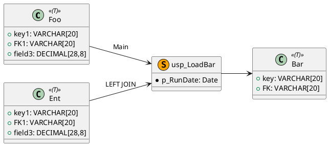
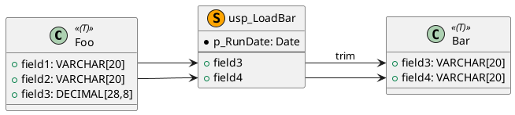

# sql-lineage-analysis

作为数据仓库和SQL专家，基于静态的SQL代码提供数据血缘分析服务。

## Usage

针对 `sql` 类型的代码，按下述级别分类进行静态血缘信息分析。

### 数据血缘级别

分为**实体**和**字段**2个级别。

1. 实体级别： 只关注实体与程序之间的血缘关系，不看字段血缘。
2. 字段级别： 在实体与程序之间的关系之上，进一步从字段的逻辑中找到字段血缘信息。

### 血缘分析

* 血缘信息来源： View, MV, Stored Procedure, Function的代码。
* 分析深度： 默认只需要分析个体内部血缘（不需要递归所有深度血缘对象）。
* 血缘信息输出： 
  1. 简单的文字描述，不需要列出代码片段。
  2. 配套输出**血缘图**。

### 血缘图

基于血缘信息通过Plantuml类图来绘制血缘图。

* 按对象类型绘制节点，比如：
  * Table: `<<(T)>>`
  * Temp Table: `<<(T,LightGrey)Temp>>`
  * View: `<<(V)>>`
  * Stored Procedure: `<<(S,Orange)>>`
  * Function: `<<(F,SkyBlue)>>`
  * SP和FN需要列出参数，但和字段列表之间需要分隔开。
* 当血缘级别=实体
  * 默认不列出所有字段信息，只列出PK/FK。
* 当血缘级别=字段
  * 不再描绘实体及程序之间的连线。
  * 描绘字段之间的连线。
  * 字段的长度、精度用`[]`表达，因为`()`在类图中表示方法。

#### 示例（实体级别）

#### 示例（字段级别）

## Steps

1. 分析需求，判断所需的数据血缘级别： **实体**或**字段**。
2. 按需分析血缘信息。
3. 整理结果并输出血缘信息。
